# **Dashboards - PowerBI**

Como forma de praticar meus conhecimentos em Business Intelligence, esse repositório contém os projetos desenvolvidos no curso "Power BI para Business Intelligence e Data Science" do "Data Science Academy"

## 💻 **Tecnologias e Conceitos**

- Power BI
- Modelagem de Dados
- Cálculos DAX

## 📊 **Projetos Desenvolvidos**

### **Dashboard Analítico de Vendas Globais**

- visualizações simples dados

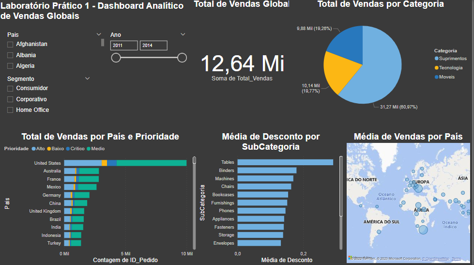

### **Dashboard de Vendas, Custo, Margem de Lucro e KPI**
- visualizações de dados
- modelagem de dados e relacionamento
- cálculos DAX

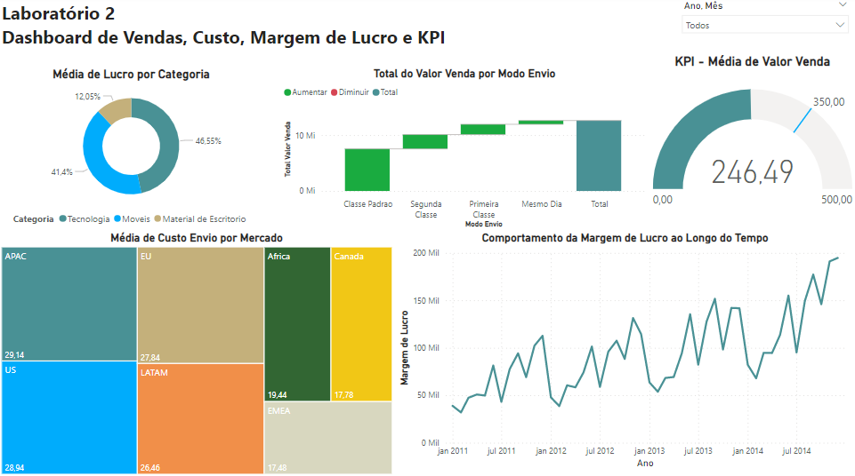

### **Dashboard de Análise de Dados de Marketing**
- visualizações de dados
- árvores hierárquicas
- gráficos de dispersão
- cálculos DAX

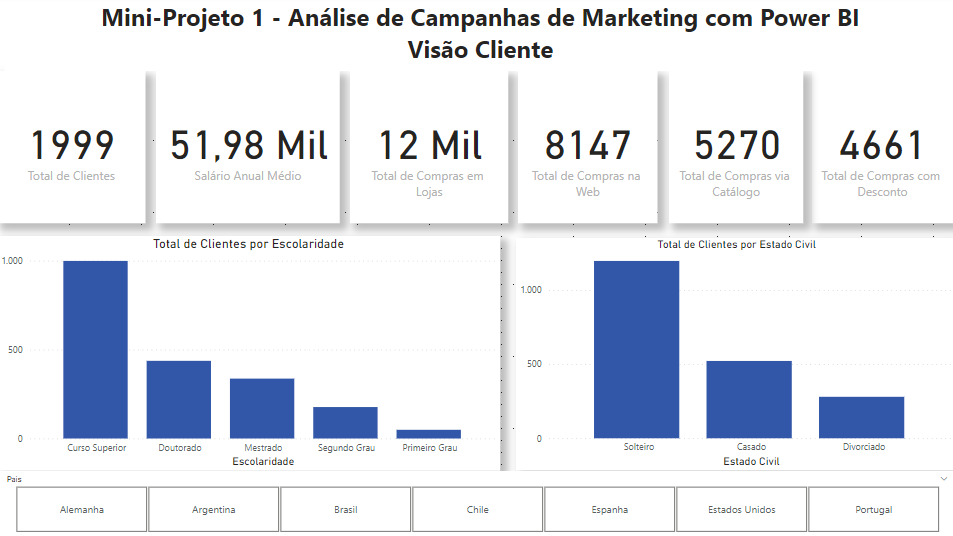

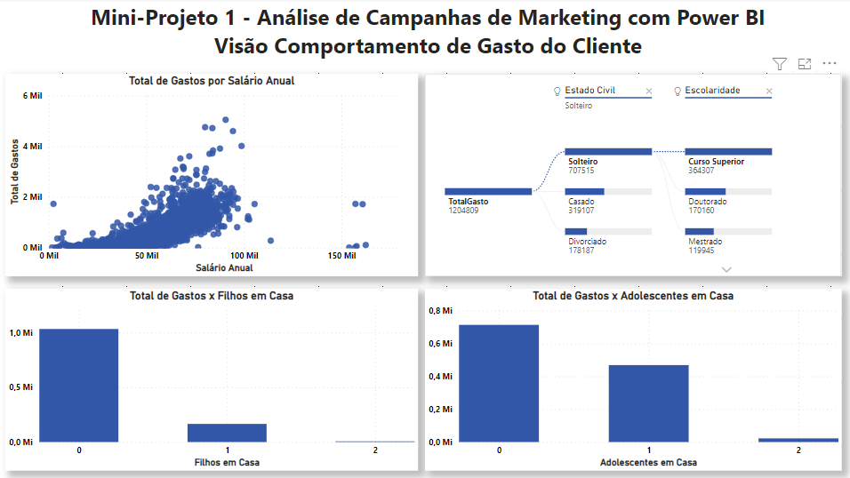

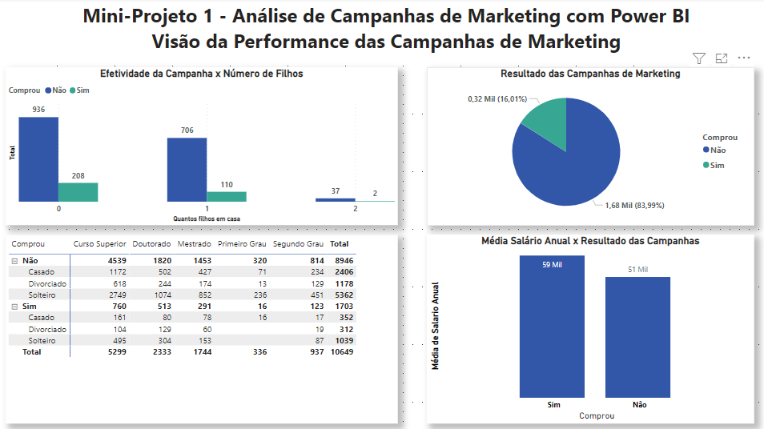

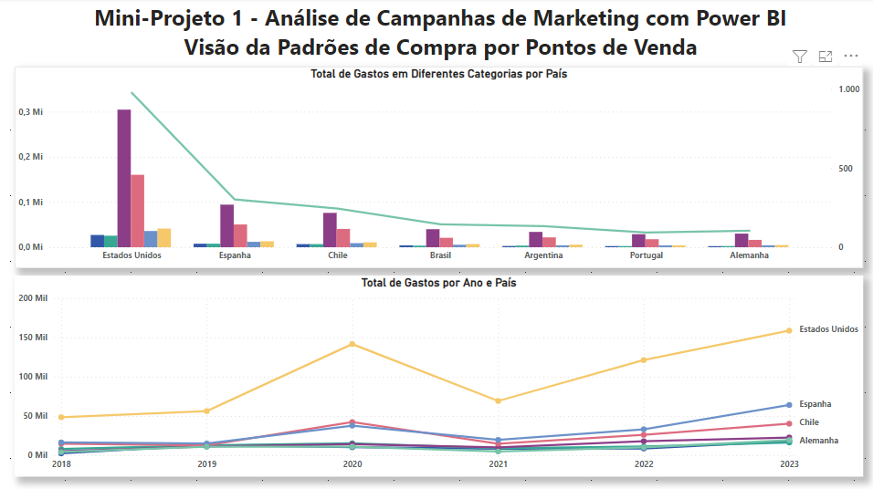

### **Dashboard Comercial - Performance de Vendas**
- visualizações de dados
- narrativa inteligente
- principais influenciadores
- gráficos de faixas
- controle deslizante
- gráficos de mapas
- recursos de paginação
- índices e navegadores

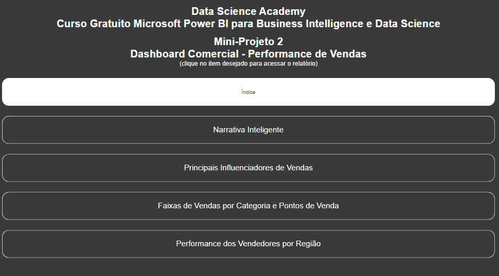

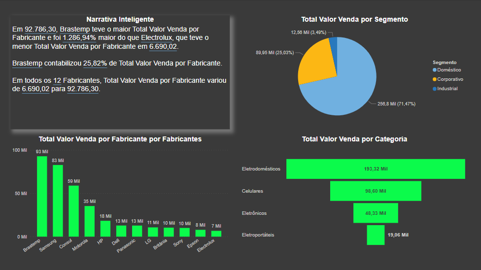

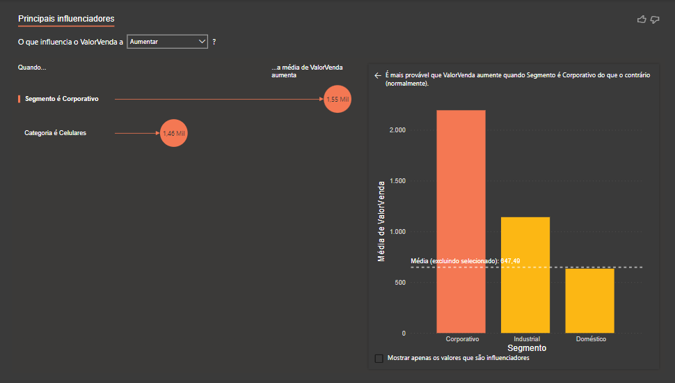

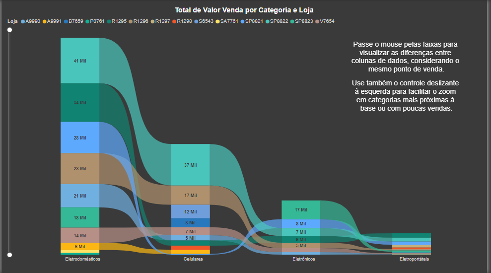

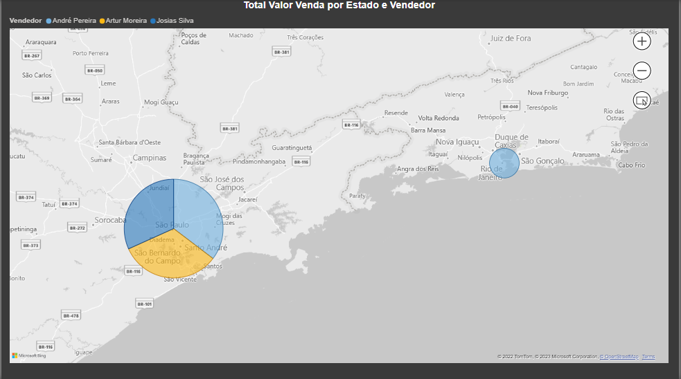

### **Dashboard de Análise de Dados de Recursos Humanos**
- visualizações de dados
- cálculos de expressões DAX
- criação de tabelas de medidas
- criação de colunas calculadas condicionais

